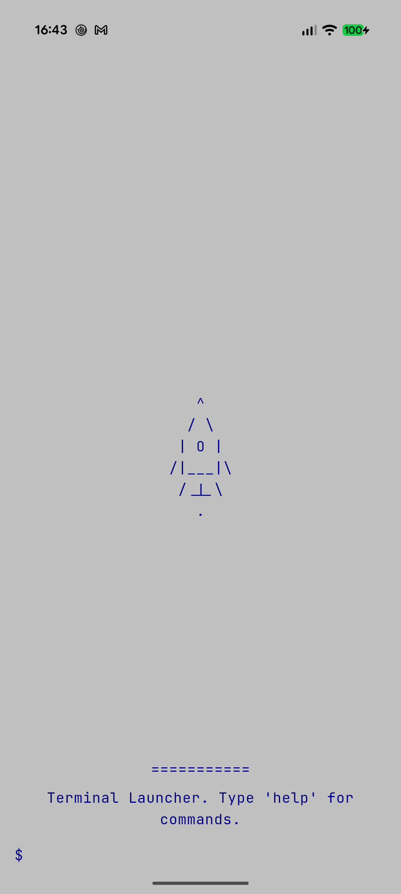
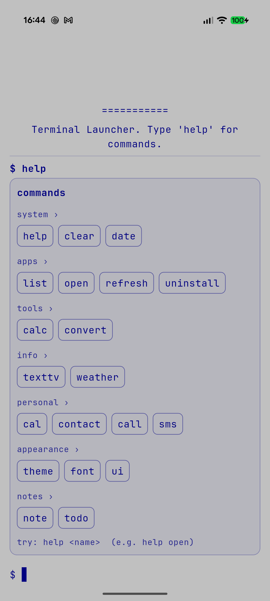
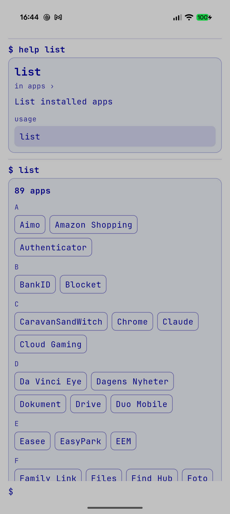
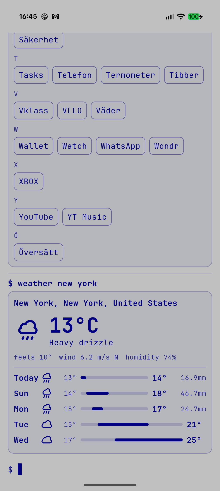
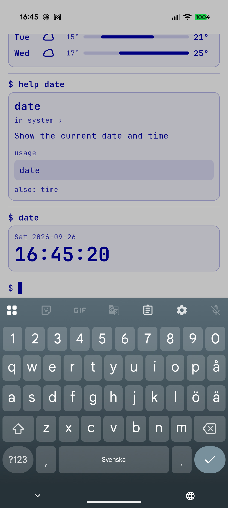
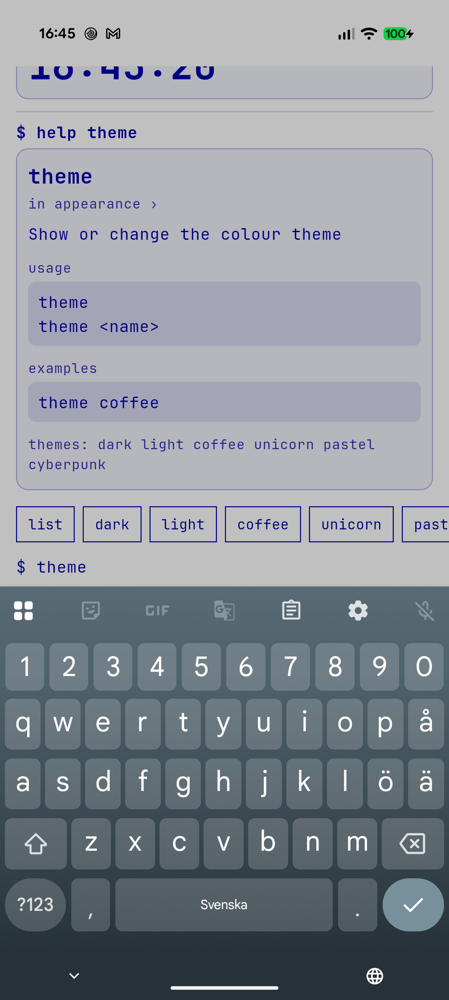

# Terminal Launcher

An Android home-screen launcher that *is* a terminal. Type `open firefox`,
`list` or `help` instead of tapping icons. Where a command has structured
output (a calendar, the weather, a phone book, your inbox, Text TV) it is drawn
as a themed card you can tap; `ui plain` turns that off for a classic text
terminal. Built with Flutter.

Everything works offline (the font is bundled; notes and settings are stored on
the device) except Text TV, weather, mail and live currency rates; currency
conversion falls back to saved rates when offline.

## Screenshots

Running on a phone in the `light` theme (navy on silver). Every card is drawn
in the current theme's colours, so all six themes look like this in their own
palette.

<table>
  <tr>
    <td align="center" width="33%">
      <br>
      <sub><b>Startup</b><br>An ASCII rocket launches, then the prompt.</sub>
    </td>
    <td align="center" width="33%">
      <br>
      <sub><b><code>help</code></b><br>Commands by group; tap a chip for that command's help.</sub>
    </td>
    <td align="center" width="33%">
      <br>
      <sub><b><code>list</code></b><br>Every app, grouped by initial; tap one to open it.</sub>
    </td>
  </tr>
  <tr>
    <td align="center" width="33%">
      <br>
      <sub><b><code>weather new york</code></b><br>Current weather and a 5-day forecast on one temperature scale.</sub>
    </td>
    <td align="center" width="33%">
      <br>
      <sub><b><code>date</code></b><br>One answer, large. <code>calc</code> and <code>convert</code> look the same.</sub>
    </td>
    <td align="center" width="33%">
      <br>
      <sub><b><code>help theme</code></b><br>Usage and examples, and the suggestion strip above the prompt.</sub>
    </td>
  </tr>
</table>

## Commands

| Command | What it does |
|---|---|
| `list` | Every launchable app, grouped by initial (A to Z, then Å Ä Ö); tap one to open it |
| `open <app>` | Launch an app (exact, then prefix, then substring match; several matches are offered to pick from) |
| `uninstall <app>` | Open Android's uninstall confirmation for an app |
| `refresh` | Re-query the installed-app list |
| `date` / `time` | The current date and time |
| `calc <expr>` | Calculate, e.g. `calc 2*(3+4)^2`, `calc sqrt(16)+pi` |
| `convert <n> <from> <to>` | Units or money, e.g. `convert 5 km mi`, `convert 100 usd sek`; `convert units`, `convert currencies` |
| `texttv [page]` | Swedish Text TV in colour, with its logos and tappable page numbers: `texttv 104`, `texttv utrikes`, `texttv 130 2` |
| `weather [city]` | Weather and a 5-day forecast, from SMHI (with the nearest station's measurements) across northern Europe and from Open-Meteo elsewhere; with no city, uses your location (or your saved home city); `weather home <city>` saves one |
| `cal [day\|week\|month]` | Your phone's calendar (read-only): a month card, or an agenda for a day or week |
| `timer <length> [label]` | Start a timer in your clock app: `timer 10m`, `timer 1h30m tea`, `timer 90s`; a bare number is minutes. With no length it opens your timers |
| `alarm <time> [days] [label]` | Set an alarm in your clock app: `alarm 07:30`, `alarm 7am`, `alarm 6:45 weekdays gym`. With no time it opens your alarms |
| `history [clear]` | The commands you use most (also shown above an empty prompt); `history clear` forgets them |
| `mail [rm <n>\|setup <email>\|forget]` | Your 20 newest emails; `mail rm 3` moves one to Trash. `mail setup you@gmail.com` asks for an app password on a hidden line (see [Mail](#mail)); `mail forget` removes the account |
| `contact <name>` / `contact list` | Look up a contact; each number has `call` and `sms` buttons. `contact list` shows everyone grouped by initial, A to Z then Å Ä Ö |
| `call <name or number>` | Call (or open the dialer if the permission is refused) |
| `sms <name or number> "text"` | Send a text message |
| `note` / `todo` | Numbered lists: `add`, `list`, `show`, `edit`, `rm`, `find`; todos also `done`, `undo`, `clear` |
| `theme [name]` | `dark`, `light`, `coffee`, `unicorn`, `pastel`, `cyberpunk` |
| `font [size]` | `small`, `normal`, `large`, `huge` |
| `ui [rich\|plain]` | Cards or plain text; add `--plain` to `cal`, `weather` or `help` for one call |
| `help [name]` | Commands by group; `help <group>` or `help <command>` for detail |
| `clear` | Clear the log |

Quote text with spaces: `note add "buy milk"`.

A command that goes online (`weather`, `texttv`, `mail`) shows a turning `[|]`
in the log while it waits, if it takes more than a moment. Quick commands never
show one.

A strip above the prompt suggests command names and, after `open ` or
`uninstall `, matching apps. With an empty prompt it shows the commands you use
most, ranked by how often and how recently (`history`), and a line you have run
before is offered as you type its start. Tapping a suggestion fills the input;
Enter runs it. Only commands that worked are remembered, taps inside cards are
not, and nothing private is kept: `sms` is never recorded, and `note`, `todo` and
`mail` keep only their name.
Buttons in cards work the same way where a stray tap could do harm: `call`,
`sms`, `note edit`, `note rm` and `uninstall` only put the command in the prompt
for you to check and send.

## Permissions

Asked for the first time a command needs them, and never otherwise: internet
(Text TV, weather, rates, mail), location (`weather`), calendar (`cal`),
contacts (`contact`, `call`, `sms`), phone (`call`) and SMS (`sms`). Refuse one
and only that command is affected. `timer` and `alarm` need the ordinary
"set alarm" permission, which Android grants at install.


## Mail

`mail` reads the newest 20 messages over IMAP: sender, subject, time, and a dot
on the unread ones, each with a number. `mail rm 3` moves message 3 of the last
list to your Trash folder, so it can be got back: it never deletes anything
outright, refuses if the server has no Trash, and goes by the server's message
id, so mail arriving in between cannot make it hit another message. The bin on a
card row only puts `mail rm #<id>` in the prompt for you to check and send.
Nothing else in the app changes your mailbox.

It signs in with an **app password**, not your normal one: for Gmail, turn on
2-step verification and create one under Google account, Security, App
passwords. Run `mail setup you@gmail.com`, then paste it on the hidden line the
terminal shows (spaces are ignored; an empty line cancels). The server is known
for Gmail, iCloud, Yahoo, AOL, Fastmail, Zoho and GMX; for any other provider
add it: `mail setup you@example.org imap.example.org`. Outlook.com and Hotmail
no longer accept app passwords, so they do not work.

The address and password are stored together in the Android Keystore (through
`flutter_secure_storage`), never in the log, and `mail forget` deletes them.

## Data sources

Weather is from [SMHI](https://opendata.smhi.se) (forecast and observations,
CC BY 4.0) where it reaches, and from [Open-Meteo](https://open-meteo.com)
elsewhere and whenever SMHI cannot answer; places are found with Open-Meteo's
geocoder. Every report says which it used. Text TV is from texttv.nu, rates from
frankfurter.app.

## Development

The repo root is the Flutter project. Run everything from here:

```
flutter pub get
flutter run                                        # device or emulator
dart format --output=none --set-exit-if-changed .
flutter analyze
flutter test
```

To use it as your launcher, install it and pick **Terminal Launcher** as the
default Home app in Android settings.

The app name shown by Android is `app_name` in
`android/app/src/main/res/values/strings.xml`. The Dart package and the Android
application id (`com.codedbykay.android_terminal_launcher`) keep their original
names; changing them is a much larger job for no visible gain.

## Layout

- `lib/terminal/` — pure-Dart core: tokenizer, registry, commands, session, and the rich-block values commands return
- `lib/services/` — service interfaces (apps, calendar, contacts, weather, mail, ...) and their Android or network implementations
- `lib/ui/` — widgets that render session state and forward input, including the card views
- `android/` — manifest and the Kotlin channel handlers (apps, permissions, location, calendar, contacts, phone, SMS)
- `test/` — mirrors `lib/`; `test/fakes/` holds the fakes
- `screenshots/` — the images shown at the top of this README
- `tool/` — `make_app_icon.py` builds the launcher icon from `icons/`

## Contributing / agents

See [AGENTS.md](AGENTS.md) and [.agents/](.agents/README.md) for architecture,
conventions and the definition of done, and [plan.md](plan.md) for what's next.
The font is JetBrains Mono, licensed under the OFL (`fonts/OFL.txt`).
